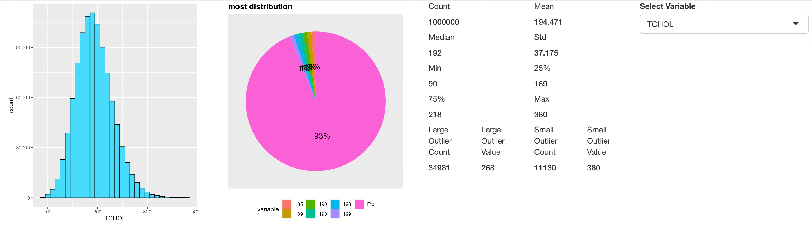
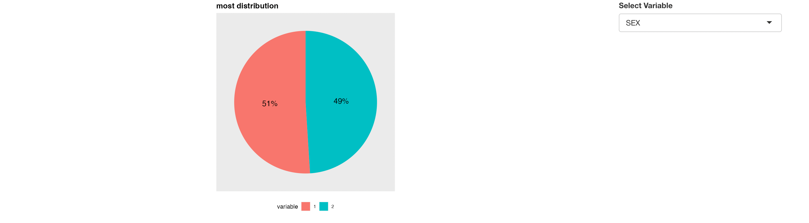

```{r, include = FALSE}
knitr::opts_chunk$set(
  collapse = TRUE,
  comment = "#>"
)
```

```{r setup}
library(board)
```


## Introduction

`board`'s `distributionModule` shows selected variables distribution (and additional information too)

In this article, we'll use bloodTest dataset of [datatoys](https://github.com/statgarten/datatoys)

This article is based on **0.0.2** Version of board.

## Declare module

`colorpen`'s module assumes that used in the [Shiny](https://shiny.rstudio.com/) application.

and You can use snippet(type `shinyapp`) to build very basic shiny application.

``` r
library(shiny)

ui <- fluidPage(
 
)

server <- function(input, output, session) {
  
}

shinyApp(ui, server)
```

This application will show nothing.

So let's add `distributionModule` in **ui**

``` r
ui <- fluidPage(
  mod_distributionModule_ui(
    id = 'distModule'
  )
)
```

also, `distributionModule` in **server**.

``` r
server <- function(input, output, session) {
  mod_distributionModule_server(
    id = 'distModule', 
    inputData = reactive(datatoys::bloodTest) 
  )
}
```

So final (which is very basic) code will like this.

``` r
library(shiny)

ui <- fluidPage(
  mod_distributionModule_ui(
    id = 'distModule'
  )
)

server <- function(input, output, session) {
  mod_distributionModule_server(
    id = 'distModule', 
    inputData = reactive(datatoys::bloodTest) # remotes::install_github('statgarten/datatoys')
  )
}

shinyApp(ui, server) # run application
```

You should notice 2 things.

1.  both `id` in **ui** and **server** should be same.
2.  `inputData` in **server** should be format of **reactive**

## Structure of distributionModule


distributionModule is consisted with `Result Area` and `Control Area`

and below using flow.

1.  Declare module (we did already)
2.  Set column to show distribution, and finish! ("reactive" result will shown)

## Usage of distributionModule

Let's change Variable like image below




Note that, many of distributionModule's function is effective with `Numeric` value. 
So it will be better if you change data's type as expected (`Sex` could be better with `Factor` not `Numeric`)

result will also be changed. (even it doesn't have much )


## Description of statistics

If distribution uses `Numeric` variable, 

It shows these statistics. ( see second figure )

- Count
- Mean
- Median
- Standard deviation (Std)
- Quantile values (0: Min, 25, 50: Median, 75, 100: Max)
- Outlier values
  - value smaller than **288** may considered as outlier. which has **34891** count.
  - value larger than **380** may considered as outlier. which has **11130** count.

For any issue or suggestion, please make issue in [board's github](https://github.com/statgarten/board/issues).
